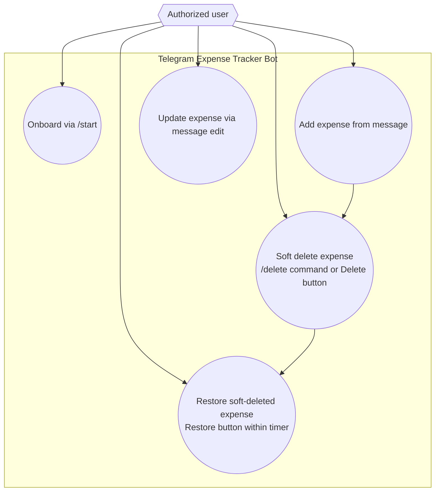

# Telegram Expense Tracker Bot Use Cases

The diagram highlights the interactions that are already implemented in the bot.

- `/start` sends onboarding guidance describing the expected expense input format.
- Sending a plain message creates a new expense record and replies with its summary and inline actions.
- Editing a previously sent message updates the stored expense details for that entry.
- Soft deletion is available either by replying `/delete` to the original message or by tapping the inline Delete button; the record is marked deleted and a countdown notice is posted.
- Tapping the Restore button within the undo window reactivates the expense and removes the deletion notice.
- Access is restricted to chat IDs configured through `ALLOWED_CHAT_IDS`; other users receive an unauthorized warning.
